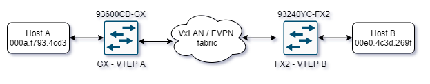

# cisco-nexus-9300-evpn-fix
Script for Nexus 9300 fixing remote static MACs learned locally

# Problem description
Cisco Nexus 9300 doesn't support "feature port-security" in combination with VxLAN/EVPN as of yet. We have discovered a few related issues one of which can lead to blackholing traffic. We believe the port-security feature will "secure" learned MAC addresses within VxLAN/EVPN fabric in a similar way as if you would configure static MAC records on the switch.

The same message will occur when:
  a) remote port is configured with port security
  b) remote MAC address is configured as static MAC entry (e.g. mac address-table static 0000.0000.0000 vlan 999 interface Ethernet1/48)

If MAC address collision will happen in your VxLAN/EVPN fabric for any reason your VTEP will report this log message as per RFC:

For GX:

  %L2RIB-2-L2RIB_LOCAL_LEARNT_MAC_PRESENT_AS_REMOTE_STATIC: Locally learnt MAC <MAC> in topology: <VLANID> already present as remote static

For FX2:

  %L2RIB-2-L2RIB_LOCAL_CONFIG_STATIC_MAC_PRESENT_AS_REMOTE_STATIC: Locally configured static MAC <MAC> in topology: <VLANID> already present as remote static

These cryptic messages are saying: "Hey, I've just seen MAC locally which is learned as secure (on the secured port) on another remote VTEP". 

**Local VTEP will learn a newly seen MAC on local port with higher priority and this record will never expire until this is cleared manually.**


 Diagram
  
 

VTEP A:

```
GX# sh mac address-table 
Legend: 
        * - primary entry, G - Gateway MAC, (R) - Routed MAC, O - Overlay MAC
        age - seconds since last seen,+ - primary entry using vPC Peer-Link,
        (T) - True, (F) - False, C - ControlPlane MAC, ~ - vsan
   VLAN     MAC Address      Type      age     Secure NTFY Ports
---------+-----------------+--------+---------+------+----+------------------
*  999     000a.f793.4cd3   dynamic  0         F      F    Eth1/1
C  999     00e0.4c3d.269f   dynamic  0         F      F    nve1(10.10.11.2)
G    -     b08b.d025.dd77   static   -         F      F    sup-eth1(R)

```
  
  00e0.4c3d.269f -> is learned remotely via nve1 which is correct.
  
**MAC collision observed**

```  
  2021 Aug 22 16:27:19 GX %L2RIB-2-L2RIB_LOCAL_LEARNT_MAC_PRESENT_AS_REMOTE_STATIC: Locally learnt MAC 00e0.4c3d.269f in topology: 999 already present as remote static
```

```
GX# sh mac address-table 
Legend: 
        * - primary entry, G - Gateway MAC, (R) - Routed MAC, O - Overlay MAC
        age - seconds since last seen,+ - primary entry using vPC Peer-Link,
        (T) - True, (F) - False, C - ControlPlane MAC, ~ - vsan
   VLAN     MAC Address      Type      age     Secure NTFY Ports
---------+-----------------+--------+---------+------+----+------------------
*  999     00e0.4c3d.269f   dynamic  0         F      F    Eth1/1
G    -     b08b.d025.dd77   static   -         F      F    sup-eth1(R)
```  

  **Remote MAC 00e0.4c3d.269f learned locally and stays learned until this record is manually cleared.**
  
  
# Solution
  Unfortunately, there is no way to disable MAC address learning on Cisco Nexus 9300. Even MAC ACL doesn't prevent Nexus from learning MACs on the port. The only solution we have found so far is to run our own Python script on all VTEPs. This script is triggered using Nexus's event manager and will issue a command "clear mac address-table dynamic address {mac} vlan {vlan}" for each MAC in a collision.
  
# Installation
  1) copy n9kl2routeclear.py to a bootflash: using scp
  2) add EEM to running-configuration
``` 
event manager applet test
  event syslog pattern "%L2RIB-2-L2RIB_LOCAL_LEARNT_MAC_PRESENT_AS_REMOTE_STATIC"
  action 1 cli python3 bootflash:///n9kl2routeclear.py
```
  4) Switch off logging rate-limit - !!! IMPORTANT STEP !!! Nexus is buffering the last message in RAM. The last message is not written in /log/messages immediately therefore "sh logg" is not qual with /log/messages file. This can lead to a situation, where the last MAC in a collision will not be cleared.
```
  no logging rate-limit
```
  3) Dry-Run - It is recommended to run with "dry_run=True" manually in order to skip all historical records in the log. Those will be skipped by dry-run (not really clearing MAC address table). The script will create init files where the last processed position is stored and only new records going to be processed. If you don't do a dry-run with the first run, the script will process all log lines with its first call and will clear the MAC address table with all historical occurrences of the message! **Don't forget to change back to "dry-run=False"!**
