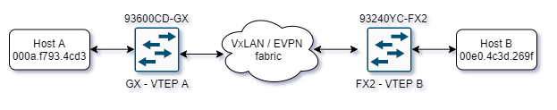

# cisco-nexus-9300-evpn-fix
Script for Nexus 9300 fixing remote static MACs learned locally

# Problem description
Cisco Nexus 9300 doesn't support "feature port-security" in combination with VxLAN/EVPN as of yet. We have discovered few related issues one of which can lead to blackholing a traffic. We believe port-security feature will "secure" learned MAC addresses within VxLAN/EVPN fabric as similar way as if you would configure static MAC records on the switch.

Same message will occur when:
  a) remote port is configured with port security
  b) remote MAC address is configured as static MAC entry (e.g. mac address-table static 0000.0000.0000 vlan 999 interface Ethernet1/48)

If MAC address collision will happen in you VxLAN/EVPN fabric for any reason your VTEP will report this log message as per RFC:

For GX:
  "%L2RIB-2-L2RIB_LOCAL_LEARNT_MAC_PRESENT_AS_REMOTE_STATIC: Locally learnt MAC <MAC> in topology: <VLANID> already present as remote static"
For FX2:
  "%L2RIB-2-L2RIB_LOCAL_CONFIG_STATIC_MAC_PRESENT_AS_REMOTE_STATIC: Locally configured static MAC <MAC> in topology: <VLANID> already present as remote static"

These cryptic messages are saying: "Hey, I've just seen MAC locally which is learned as secure (on secured port) on another remote VTEP". 

**Local VTEP will learn newly seen MAC on local port with higher priority and this record will never expire, until this is cleared manually.**

 

  
